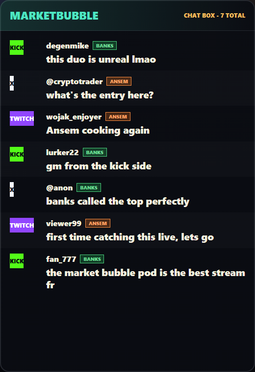

# Unified Stream Chat

Unified Stream Chat is a production-ready multi-platform chat layer for streamers. Add a streamer by name and the channels they use, and their Twitch, X, and Kick chats merge into one live feed — color-tagged per host — with a clean transparent OBS overlay. No login or OAuth from the streamers themselves.

Built for multi-host shows: several streamers' chats in one box, each in their own color, so a co-streamed broadcast reads as a single conversation.

Live demo: <https://unified-stream-chat.vercel.app>

## Screenshots

Clean OBS chat box — multiple hosts merged into one feed, each color-tagged:



Dashboard: add chat watchers, see the unified source-labeled feed:


Transparent OBS lower-third and vertical rail overlays are also included:


## Features

- Chat watchers: add a streamer by name + channels and aggregate their public chats — no login or OAuth from the streamer, with per-platform on/off toggles.
- Twitch chat through the official IRC WebSocket (multi-channel).
- X posts through official X API v2 recent search with one-click sync or 25-second auto-polling.
- X live-broadcast chat via an optional local browser bridge (`npm run x-live`) — X has no API for it.
- Kick chat through official `chat.message.sent` webhook events, auto-subscribed per watched channel.
- One normalized live feed with source labels and per-host colored identity tags.
- Transparent `/overlay` page for OBS browser sources.
- Multiple overlay shapes: full-width lower third, vertical side rail, and compact corner box.
- Server-sent events for low-latency dashboard/overlay updates, with polling fallback.
- Optional write auth for production.
- Optional Upstash Redis REST persistence for multi-instance hosting.
- Optional Kick RSA signature verification.
- Docker-ready and dependency-light.

## Quick Start

```powershell
git clone https://github.com/psychedelanon/unified-stream-chat.git
cd unified-stream-chat
npm install
npm run setup
npm run dev
```

Open:

- Dashboard: `http://127.0.0.1:8787/`
- OBS overlay: `http://127.0.0.1:8787/overlay`
- OBS right rail: `http://127.0.0.1:8787/overlay?layout=rail&position=right&messages=5`
- Kick webhook: `http://127.0.0.1:8787/api/kick/webhook`

Click `Seed All` or `Demo Pulse` to see all three source labels immediately.

Run a setup check at any time:

```powershell
npm run doctor
```

## Chat Watchers

The core flow. Add a streamer under **Chat Watchers** — name, color, and
any of their channels (X handle, Twitch channel, Kick channel) — and their
public chats merge into the feed tagged with their color. The streamer never
logs in or connects anything:

- **Kick**: the server subscribes to `chat.message.sent` webhooks for the
  channel using app-token credentials. Fully automatic from then on.
- **Twitch**: the dashboard joins the channel over Twitch's official IRC
  WebSocket (all watched channels share one socket).
- **X**: replies and mentions of the handle start polling automatically via
  the official v2 recent-search API.

Each watcher row shows X / Twitch / Kick toggle chips; muting a platform is
enforced server-side. Multiple watchers make this a multi-host show tool:
every message carries both a platform label and a colored host tag.

## OBS Setup

1. Add a Browser Source.
2. URL — the **chat box** is the recommended overlay (copy the exact URL from
   the dashboard's OBS Overlays panel, or use):
   - Chat box: `http://127.0.0.1:8787/overlay?layout=box`
   - Lower third: `http://127.0.0.1:8787/overlay`
   - Right rail: `http://127.0.0.1:8787/overlay?layout=rail&position=right&messages=5`
   - Compact corner: `http://127.0.0.1:8787/overlay?layout=compact&position=bottom-right&messages=3`
3. Size the source to your scene (the chat box fills whatever width/height you
   give it; the lower third / rail / compact layouts assume a 1920x1080 source).
4. Enable transparent background if OBS prompts for it.

The chat box is a clean scrolling panel (newest at the bottom, like real chat),
showing the latest ~14 messages with platform badges and per-host color tags.
Add `&title=YourShow` to brand the header. The lower third, rail, and compact
corner layouts are alternatives for shows that already have a chat element.

## Production Setup

Copy `.env.example` to `.env` and configure what you need:

```text
PUBLIC_BASE_URL=https://your-domain.example
STREAM_CHAT_ADMIN_TOKEN=generate-a-long-random-token
X_BEARER_TOKEN=optional-x-api-bearer-token
UPSTASH_REDIS_REST_URL=optional-upstash-url
UPSTASH_REDIS_REST_TOKEN=optional-upstash-token
KICK_PUBLIC_KEY=optional-kick-public-key
KICK_CLIENT_ID=optional-enables-kick-watcher-auto-subscribe
KICK_CLIENT_SECRET=optional-enables-kick-watcher-auto-subscribe
```

Run with Node:

```powershell
npm install --omit=dev
npm run setup
npm start
```

Run with Docker:

```powershell
docker compose up -d --build
```

For Kick webhooks on a local machine, expose the app with a tunnel:

```powershell
cloudflared tunnel --url http://127.0.0.1:8787
```

Then set the Kick app webhook URL to:

```text
https://your-tunnel.trycloudflare.com/api/kick/webhook
```

## X Live Chat Bridge (optional)

X exposes no API for the chat inside a live broadcast, so the bridge reads
it from a real signed-in browser (X live chat rides Periscope chat infra;
the parser is calibrated to that frame format). The streamers never log in —
the bridge only reads the public chat every viewer sees, and its browser
just needs *some* X session (a burner works).

Setup on one PC:

1. `npm run x-login` once — sign into any X account, close the window. The
   session persists in `.local/x-chat-profile`.
2. Configure `.local/x-live.config` (see `.env.example` for the `X_LIVE_*`
   keys), or copy the ready-made command from the dashboard's X Live Chat
   panel.
3. `npm run x-live` — it watches the configured account, attaches to each
   broadcast as it goes live, and relays chat tagged with the host's color.

Optionally drop a shortcut to `scripts\x-live-forever.bat` into
`shell:startup` so it survives reboots and crashes. This is a power feature —
the normal watcher flow never needs it.

## API

```text
GET    /health
GET    /api/config
GET    /api/messages
GET    /api/events
GET    /api/connections?room=...
POST   /api/hosts
POST   /api/hosts/toggle
DELETE /api/connections?room=&profile=&platform=
POST   /api/ingest
POST   /api/messages
DELETE /api/messages
GET    /api/x/recent?query=...
POST   /api/kick/webhook
```

When `STREAM_CHAT_ADMIN_TOKEN` is set, write routes require either:

```text
Authorization: Bearer <token>
x-stream-chat-token: <token>
```

Kick webhook writes are accepted without the admin token so Kick can call them directly. Set `KICK_PUBLIC_KEY` in production if you want signature verification.

## Local Proof

```powershell
npm run check
npm run seed
npm run verify
```

`npm run verify` checks:

- API state has Twitch, X, and Kick messages.
- Dashboard renders on desktop.
- Dashboard renders on mobile without horizontal overflow.
- OBS overlay renders at 1920 x 1080.
- No browser console errors or visible loading/error/empty states when data exists.

Screenshots are written to `.local/verification/`.

For deployed apps, run:

```powershell
$env:STREAM_CHAT_BASE_URL = "https://your-live-app.example"
npm run smoke:live
```

Seed a deployed demo directly:

```powershell
node scripts\seed-demo.mjs https://your-live-app.example
```

## Deployment

See [docs/DEPLOY.md](docs/DEPLOY.md). The repo includes:

- `Dockerfile`
- `docker-compose.yml`
- `render.yaml`
- `Procfile`
- `vercel.json` and `api/stream.js` for demo/preview deployments
- Local verification scripts: `npm run check`, `npm run doctor`, `npm run verify`, and `npm run smoke:live`

## Contest Demo

- [Demo recording guide](docs/DEMO.md)
- [Publish and submit checklist](docs/SUBMIT.md)
- [Submission brief](SUBMISSION.md)

## BITCOINAQUA Integration

The Sproto stream can consume this standalone app by setting:

```powershell
$env:SPROTO_CHAT_OVERLAY_URL = "http://127.0.0.1:8787/overlay"
cd C:\Users\mgmay\Code\bitcoinaqua-sproto-stream
node scripts\obs-layout-sproto-gameplay.mjs
```

See [docs/BITCOINAQUA.md](docs/BITCOINAQUA.md).
