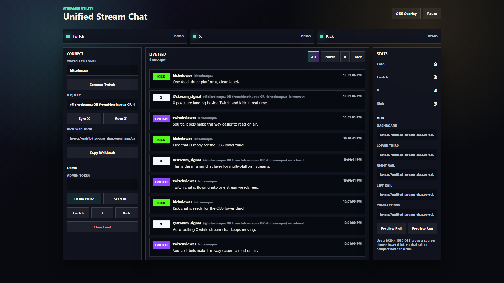
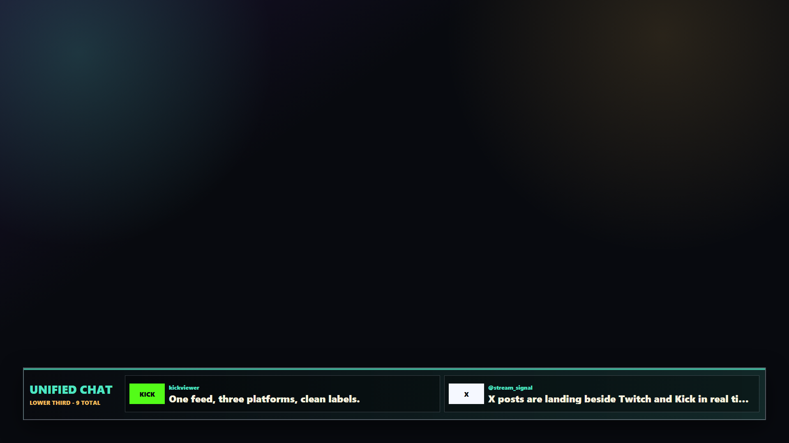
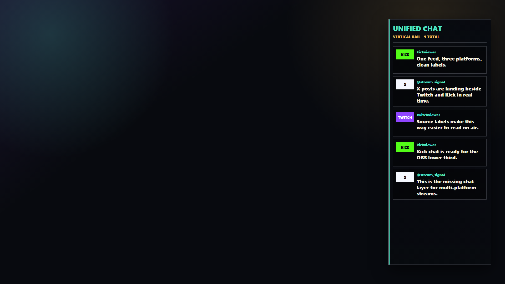

# Unified Stream Chat

Unified Stream Chat is a production-ready multi-platform chat layer for streamers. It combines Twitch, X, and Kick into one live feed with visible source labels, plus a transparent OBS overlay that can sit on top of any stream layout.

This is the standalone contest product. The BITCOINAQUA Sproto stream uses it as one integration example, but any streamer can run it for their own show.

Live demo: <https://unified-stream-chat.vercel.app>

## Screenshots

Dashboard with the unified, source-labeled feed:



Transparent OBS lower-third overlay:



Vertical side rail for broadcast layouts that already use a lower third:



## Features

- Twitch chat through the official IRC WebSocket.
- X posts through official X API v2 recent search with one-click sync or 25-second auto-polling.
- Kick chat through official `chat.message.sent` webhook events.
- One normalized live feed with source labels.
- Transparent `/overlay` page for OBS browser sources.
- Multiple overlay shapes: full-width lower third, vertical side rail, and compact corner box.
- Server-sent events for low-latency dashboard/overlay updates, with polling fallback.
- Optional write auth for production.
- Optional Upstash Redis REST persistence for multi-instance hosting.
- Optional Kick RSA signature verification.
- Docker-ready and dependency-light.

## Quick Start

```powershell
git clone https://github.com/psychedelanon/unified-stream-chat.git
cd unified-stream-chat
npm install
npm run setup
npm run dev
```

Open:

- Dashboard: `http://127.0.0.1:8787/`
- OBS overlay: `http://127.0.0.1:8787/overlay`
- OBS right rail: `http://127.0.0.1:8787/overlay?layout=rail&position=right&messages=5`
- Kick webhook: `http://127.0.0.1:8787/api/kick/webhook`

Click `Seed All` or `Demo Pulse` to see all three source labels immediately.

Run a setup check at any time:

```powershell
npm run doctor
```

## OBS Setup

1. Add a Browser Source.
2. URL: choose one:
   - Lower third: `http://127.0.0.1:8787/overlay`
   - Right rail: `http://127.0.0.1:8787/overlay?layout=rail&position=right&messages=5`
   - Left rail: `http://127.0.0.1:8787/overlay?layout=rail&position=left&messages=5`
   - Compact box: `http://127.0.0.1:8787/overlay?layout=compact&position=bottom-right&messages=3`
3. Width: `1920`
4. Height: `1080`
5. Enable transparent background if OBS prompts for it.

The lower-third renders the latest two messages. The rail renders up to five messages in a vertical box so it can sit beside a guest/source frame without covering a show's bottom banner or ticker.

## Production Setup

Copy `.env.example` to `.env` and configure what you need:

```text
PUBLIC_BASE_URL=https://your-domain.example
STREAM_CHAT_ADMIN_TOKEN=generate-a-long-random-token
X_BEARER_TOKEN=optional-x-api-bearer-token
UPSTASH_REDIS_REST_URL=optional-upstash-url
UPSTASH_REDIS_REST_TOKEN=optional-upstash-token
KICK_PUBLIC_KEY=optional-kick-public-key
```

Run with Node:

```powershell
npm install --omit=dev
npm run setup
npm start
```

Run with Docker:

```powershell
docker compose up -d --build
```

For Kick webhooks on a local machine, expose the app with a tunnel:

```powershell
cloudflared tunnel --url http://127.0.0.1:8787
```

Then set the Kick app webhook URL to:

```text
https://your-tunnel.trycloudflare.com/api/kick/webhook
```

## API

```text
GET    /health
GET    /api/config
GET    /api/messages
GET    /api/events
POST   /api/ingest
POST   /api/messages
DELETE /api/messages
GET    /api/x/recent?query=...
POST   /api/kick/webhook
```

When `STREAM_CHAT_ADMIN_TOKEN` is set, write routes require either:

```text
Authorization: Bearer <token>
x-stream-chat-token: <token>
```

Kick webhook writes are accepted without the admin token so Kick can call them directly. Set `KICK_PUBLIC_KEY` in production if you want signature verification.

## Local Proof

```powershell
npm run check
npm run seed
npm run verify
```

`npm run verify` checks:

- API state has Twitch, X, and Kick messages.
- Dashboard renders on desktop.
- Dashboard renders on mobile without horizontal overflow.
- OBS overlay renders at 1920 x 1080.
- No browser console errors or visible loading/error/empty states when data exists.

Screenshots are written to `.local/verification/`.

For deployed apps, run:

```powershell
$env:STREAM_CHAT_BASE_URL = "https://your-live-app.example"
npm run smoke:live
```

Seed a deployed demo directly:

```powershell
node scripts\seed-demo.mjs https://your-live-app.example
```

## Deployment

See [docs/DEPLOY.md](docs/DEPLOY.md). The repo includes:

- `Dockerfile`
- `docker-compose.yml`
- `render.yaml`
- `Procfile`
- `vercel.json` and `api/stream.js` for demo/preview deployments
- Local verification scripts: `npm run check`, `npm run doctor`, `npm run verify`, and `npm run smoke:live`

## Contest Demo

- [Demo recording guide](docs/DEMO.md)
- [Publish and submit checklist](docs/SUBMIT.md)
- [Submission brief](SUBMISSION.md)

## BITCOINAQUA Integration

The Sproto stream can consume this standalone app by setting:

```powershell
$env:SPROTO_CHAT_OVERLAY_URL = "http://127.0.0.1:8787/overlay"
cd C:\Users\mgmay\Code\bitcoinaqua-sproto-stream
node scripts\obs-layout-sproto-gameplay.mjs
```

See [docs/BITCOINAQUA.md](docs/BITCOINAQUA.md).
